## Objectifs <!-- omit in toc -->
- Découvrir les fonctions de dessin 2D dans la balise Canvas
- Apprendre comment animer du contenu dans le Canvas
- Utiliser les fonctionnalités du Context2D pour simplifier le code
- Permettre à l'utilisateur.rice de contrôler le contenu affiché dans le Canvas

## Sommaire <!-- omit in toc -->
- [A. Préparatifs](#a-préparatifs)
- [B. Prise en main](#b-prise-en-main)
	- [B.1. styles](#b1-styles)
	- [B.2. un dessin](#b2-un-dessin)
- [C. Premier pas : un tableau blanc](#c-premier-pas-un-tableau-blanc)
- [D. les fonctions de base](#d-les-fonctions-de-base)
	- [D.1. méthodes de dessin](#d1-méthodes-de-dessin)
	- [D.2. remplissage et contour](#d2-remplissage-et-contour)
	- [D.3. Tableau blanc et beginPath](#d3-tableau-blanc-et-beginpath)
	- [D.4. images](#d4-images)
- [E. Animation](#e-animation)
- [F. Contrôle avec le clavier](#f-contrôle-avec-le-clavier)
- [G. A propos de la taille du canvas](#g-a-propos-de-la-taille-du-canvas)
- [H. Mise en pratique : un monstre dans un tableau blanc](#h-mise-en-pratique-un-monstre-dans-un-tableau-blanc)


## A. Préparatifs
1. **Commencez par faire un fork du TP en vous rendant directement sur https://gitlab.univ-lille.fr/jsae/tp1-canvas/-/forks/new**

	Pour le `namespace` choisissez de placer le fork dans votre profil utilisateur.\
	Pour `Visibility Level` sélectionnez le **mode "private"**

2. **Ajoutez votre encadrant.e de TP en tant que "reporter"** (`@patricia.everaere-caillier` ou `@thomas.fritsch`)
3. **Clonez votre fork et ouvrez le dossier du TP dans vscode.**
4. **Installez les dépendances du projet** avec `npm i`
5. **Lancez webpack-dev-server** avec `npm start`

	Vous vous souvenez à quoi sert **exactement** webpack-dev-server ? Non ? Alors faites vite fait un tour ici : https://gitlab.univ-lille.fr/js/tp3/-/blob/main/C-modules.md#c6-webpack-live-reload

6. **Lancez une session de debug dans vscode en appuyant sur la touche <kbd>F5</kbd>.**

7. **Vérifiez que le rendu dans le navigateur est bien le suivant**, et si oui, vous allez pouvoir passer à la suite. \

	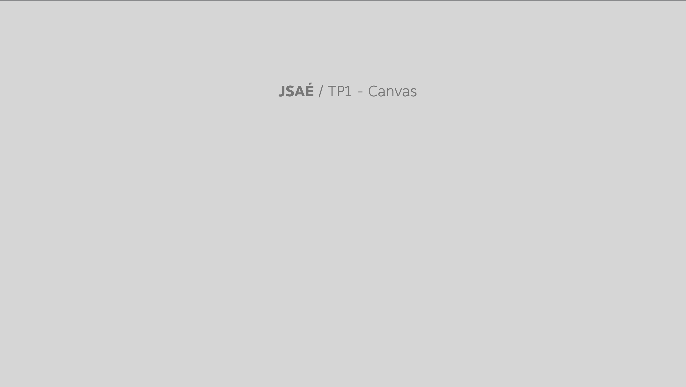

	Dans la "Debug Console" de vscode, vous devez voir s'afficher le message suivant :

	```
	Salut, can vas ? 🫠
	```

	**🚨 En cas de problème, harcelez votre encadrant.e de TP 🚨 (_il ne faut pas perdre de temps sur cette étape_) !**

## B. Prise en main

### B.1. styles

**Commencez par consulter le contenu du fichier `index.html` : Vous devez voir que le body contient (_en plus du `<h1>`_) une balise `<canvas>`.**

Cette balise canvas n'est pas visible de base à l'écran. Normal car nous n'avons pour le moment rien dessiné dedans ! En effet, de base, un canvas s'affiche comme n'importe quelle balise `<div>` : un cadre transparent.

Comme toutes les balises HTML, il est en revanche possible de styler le canvas avec du CSS : Dans le fichier `index.html` vous verrez qu'est prévue une balise `<style>` dans laquelle vous pouvez écrire du code CSS (_bien entendu, vous pouvez aussi écrire dans le fichier `main.css` si vous préférez_) :

```html
<style>
	canvas {
		/* tapez ici votre code CSS */
	}
</style>
```

Pour que l'on voit que notre canvas est bien présent à l'écran, ajoutez dans le sélecteur "canvas" les règles CSS suivantes :
```css
background-color: white;
border: 3px dashed #777;
```

Tada, le canvas est enfin visible :
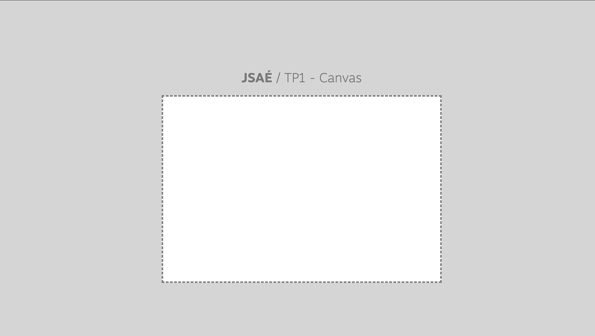

> _**NB :** Notez qu'on aurait tout à fait pu laisser le canvas transparent et dessiner dedans. Là pour la suite de l'exercice ça nous aidera de "voir" les limites du canvas._

### B.2. un dessin

**Maintenant qu'on voit notre canvas, vous pouvez commencer à dessiner dessus :**

1. Comme vu en cours, pour dessiner dans un canvas il faut d'abord récupérer son [Context _(mdn)_](https://developer.mozilla.org/en-US/docs/Web/API/CanvasRenderingContext2D). Dans votre `main.js` récupérez une référence vers le canvas puis appelez dessus la méthode `.getContext('2d')` pour récupérer le "contexte" qui va nous permettre de dessiner en 2D.

	```js
	const canvas = document.querySelector('.gameCanvas'),
		context = canvas.getContext('2d');
	```

2. Une fois le context récupéré, vous pouvez enfin tracer votre premier trait en JS :

	```js
	context.moveTo(0, 0);
	context.lineTo(600, 400);
	context.stroke();
	```

	> NB : on utilise ici les coordonnées 600, 400 car notre canvas fait 600 pixels de large et 400 pixels de haut comme spécifié dans le HTML :
	> ```html
	> <canvas class="gameCanvas" width="600" height="400"></canvas>
	> ```

	Pour rappel les coordonnées `x=0,y=0` d'un canvas sont en haut à gauche :

	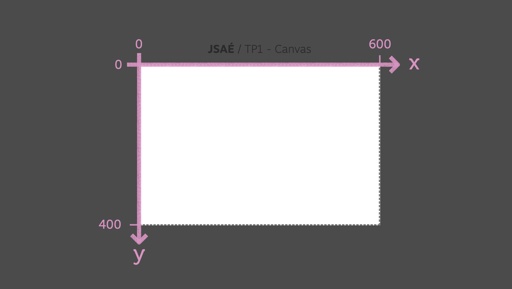

	Du coup, le code qu'on a tapé va afficher une diagonale du coin haut-gauche (`0,0`) au coin bas-droite (`600,400`) :

	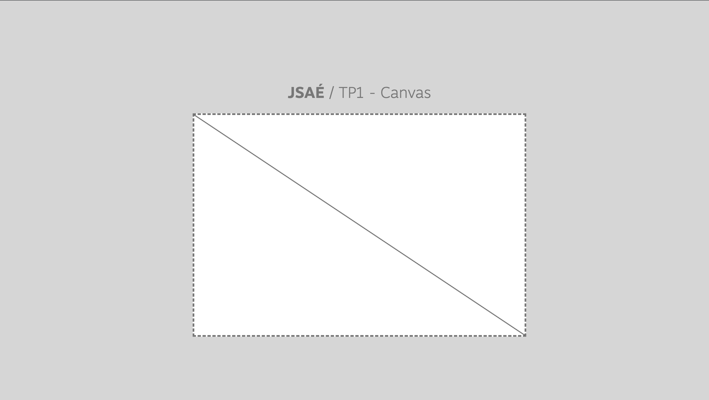


## C. Premier pas : un tableau blanc

**Bon, utiliser un canvas juste pour tracer une diagonale, c'est un peu "abusé". Par contre, rien qu'avec ces 3 méthodes `moveTo` / `lineTo` et `stroke`, on peut déjà essayer de faire un truc un peu sympa, comme par exemple une appli de tableau blanc "minimaliste".**

1. **Commencez par effacer les 2 dernières lignes tapées précédemment :** ne conservez que le `context.moveTo(0, 0);` : le canvas doit s'afficher à nouveau vide.
2. **Écoutez le clic sur le canvas à l'aide de la méthode [`addEventListener` _(mdn)_](https://developer.mozilla.org/fr/docs/Web/API/EventTarget/addEventListener).** Faites pour le moment juste un `console.log` (_peu importe le texte_) pour vérifier que quand vous cliquez le message s'affiche bien dans la console.
3. **Dans la fonction déclenchée au clic, utilisez les propriétés [`event.offsetX` _(mdn)_](https://developer.mozilla.org/fr/docs/Web/API/MouseEvent/offsetX) et [`event.offsetY` _(mdn)_](https://developer.mozilla.org/fr/docs/Web/API/MouseEvent/offsetY) pour tracer un trait à l'endroit où l'utilisateur a cliqué**

	> _Si rien ne s'affiche, n'oubliez pas que tant que vous ne faites pas appel à `stroke()`, le dessin n'a pas d'apparence particulière !_

	Vous devriez avoir un truc de ce genre :

	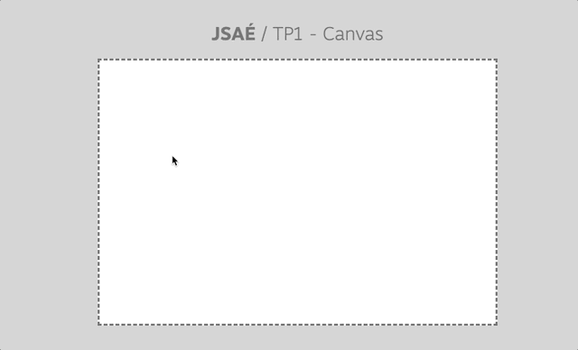

	Notre code tient en même pas 5 lignes et pourtant, avec un peu de talent on peut obtenir des oeuvres d'une rare beauté :

	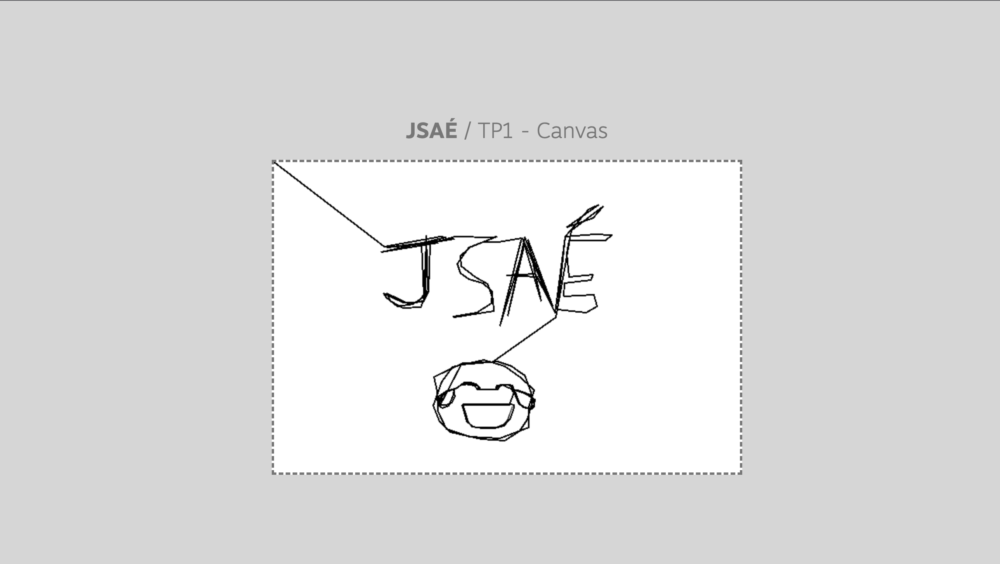

4. **Pour fluidifier un peu le rendu je vous propose de faire en sorte que le dessin ne se fasse plus simplement au `click` mais à chaque déplacement de la souris** à l'aide de l'événement `mouseMove`.

	Remplacez simplement le nom de l'événement que vous écoutez (`click`) par `mousemove` (_tout en minuscule_) : le dessin se fait alors automatiquement rien qu'en déplaçant la souris sur le canvas ! Magnifique !

	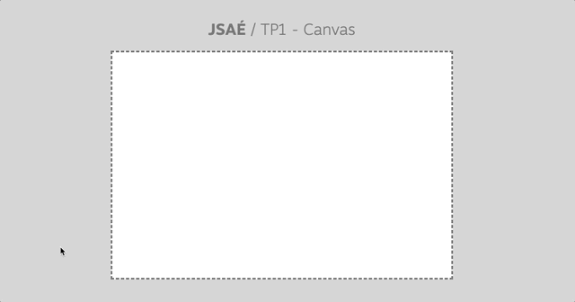


## D. les fonctions de base

### D.1. méthodes de dessin

Les méthodes moveTo et lineTo ne sont pas nos seuls moyens de dessiner dans le canvas. En effet, le canvas dispose de méthodes pour dessiner des primitives simples, notamment des rectangles et des cercles.

1. **Commentez le code de l'exercice précédent** (_il vous sera utile par la suite_) et ne conservez que les constantes `canvas` et `context`.
2. **Consulter la documentation et testez la méthode [`context.rect()` _(mdn)_](https://developer.mozilla.org/fr/docs/Web/API/CanvasRenderingContext2D/rect)**

	> _**NB :** il existe aussi une **méthode [`context.strokeRect()` (mdn)](https://developer.mozilla.org/fr/docs/Web/API/CanvasRenderingContext2D/strokeRect)** qui permet de faire l'équivalent d'un `.rect() + .stroke()`_

3. **Faites de même pour la méthode [`context.arc()` _(mdn)_](https://developer.mozilla.org/fr/docs/Web/API/CanvasRenderingContext2D/arc)**

	> _Si vous souhaitez faire des ellipses et pas des cercles vous pouvez utiliser... [`context.ellipse()` (mdn)](https://developer.mozilla.org/fr/docs/Web/API/CanvasRenderingContext2D/ellipse) !_


### D.2. remplissage et contour

Pour le moment vous n'avez tracé que des formes avec un contour noir, mais comme vu en cours on peut changer :
- la couleur du trait avec [`strokeStyle` _(mdn)_](https://developer.mozilla.org/fr/docs/Web/API/CanvasRenderingContext2D/strokeStyle)
- l'épaisseur du trait avec [`lineWidth` _(mdn)_](https://developer.mozilla.org/en-US/docs/Web/API/CanvasRenderingContext2D/lineWidth)
- la couleur de remplissage avec [`fillStyle` _(mdn)_](https://developer.mozilla.org/en-US/docs/Web/API/CanvasRenderingContext2D/fillStyle)

À l'aide de ces 3 méthodes et de celles vues plus haut tracez en même temps à l'écran (_mais à 2 endroits **différents** du canvas pour qu'ils ne se superposent pas_) :

1. un carré de 100 pixels de côté, rempli en vert et sans contour
2. un cercle bleu de 50 pixels de rayon, avec un contour violet de 4 pixels d'épaisseur

il y a des chances que contrairement à ce que vous espérez, le rendu soit le suivant :

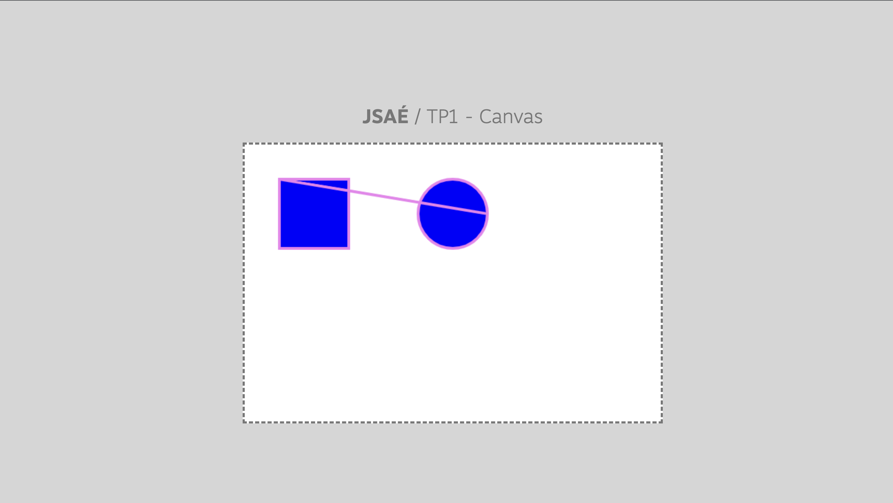

C'est normal : il faut en fait toujours indiquer au canvas quand on dessine une nouvelle forme pour lui dire de ne pas appliquer les instructions `fill()` et `stroke()` à ce qui était dessiné avant.

Cela se fait avec l'instruction [beginPath() _(mdn)_](https://developer.mozilla.org/fr/docs/Web/API/CanvasRenderingContext2D/beginPath) : **ajoutez une instruction beginPath avant chaque dessin, en principe tout va beaucoup mieux maintenant :**

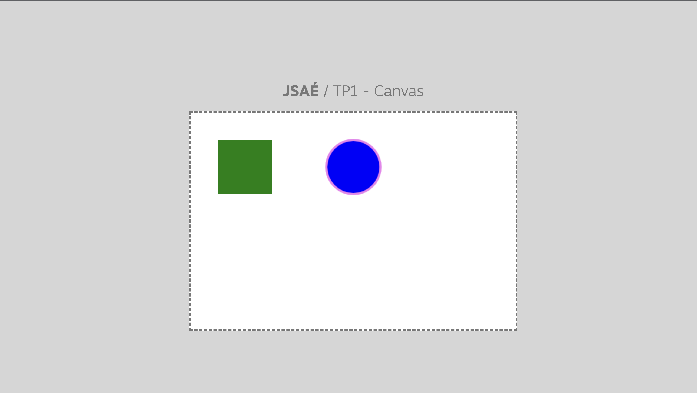

> _**NB :** pour contrôler plus finement les contours (pas très utile pour les cercles mais plus pour les autres types de formes) vous pouvez aussi utiliser les propriétés [lineCap](https://developer.mozilla.org/fr/docs/Web/API/CanvasRenderingContext2D/lineCap) et [lineJoin](https://developer.mozilla.org/fr/docs/Web/API/CanvasRenderingContext2D/lineJoin)_

### D.3. Tableau blanc et beginPath

Maintenant que vous avez compris l'utilité de `beginPath`, vous allez pouvoir améliorer l'UX de votre application de tableau blanc en faisant en sorte que le dessin ne se fasse que si le bouton de la souris est appuyé et se stoppe quand on le relâche !

Pour cela vous aurez besoin, en plus de `beginPath` des events `mousedown` (_pour détecter l'appui sur le bouton de la souris_) et `mouseup` (_pour quand le bouton est relâché_).

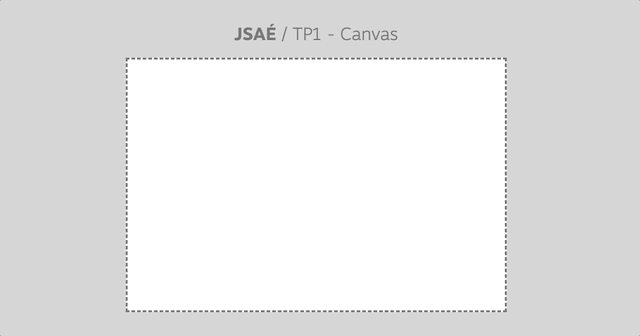


### D.4. images

**Comme vu en cours, il est possible d'injecter des images bitmap dans le canvas à l'aide de la méthode [`drawImage()` _(mdn)_](https://developer.mozilla.org/fr/docs/Web/API/CanvasRenderingContext2D/drawImage).**

Comme expliqué en amphi, avant de pouvoir injecter une image dans le canvas il faut d'abord la charger. On a plusieurs méthodes pour faire ça, mais je vous préconise celle-ci :

```js
const image = new Image();
image.src = '/images/monster.png';
image.addEventListener('load', event => {
	context.drawImage(image, 0, 0);
});
```

> Notez que
> - on charge une image qui se trouve dans le dossier `/images` du TP
> - ça déclenche une requête HTTP que vous devez voir passer dans l'onglet Réseau/Network des devtools
> - on doit obligatoirement attendre que l'image soit finie de télécharger pour la dessiner dans le canvas, sinon le context ne peut pas lire les pixels de l'image et la reproduire dans le canvas !

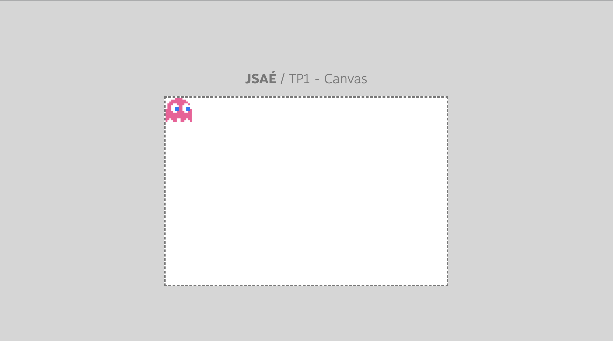

## E. Animation

**Pour animer un canvas le principe est simple : dessiner à intervalles régulier une nouvelle image.**

Pour lancer des traitements à intervalles réguliers en JS on a plusieurs techniques à notre disposition :
- [`setInterval()` _(mdn)_](https://developer.mozilla.org/en-US/docs/Web/API/setInterval)
- [`requestAnimationFrame()` _(mdn)_](https://developer.mozilla.org/fr/docs/Web/API/window/requestAnimationFrame)

Première info à savoir, le navigateur est capable de re-rendre le canvas à un certain framerate bien précis. \
La valeur de ce framerate dépend de la fréquence de rafraîchissement de l'écran : sur un écran en 60Hz il se rendra en 60fps (_"frames per seconds"_) mais sur un écran en 120Hz, il se redessinera en 120fps.

1. **`setInterval` n'est pas une fonction adaptée aux instructions de dessin dans un canvas.** En effet, quand on lance un setInterval, on lui indique le nombre de millisecondes entre chaque appel.

	Par exemple si l'on fait `setInterval(maFonction, 16)`, la fonction `maFonction` sera appelée toutes les 16 millisecondes. Le problème c'est que le moment où maFonction s'exécute ne tombe probablement pas "pile" sur une des "frames" du navigateur (_les 60 ou 120 fps dont on parlait juste avant_). Par conséquent, si `maFonction` contient des appels à `context.stroke()`, `context.drawImage()`, ou à n'importe quelle autre méthode de dessin dans le canvas, on ne sera pas "synchronisés" avec le rendu interne du navigateur : on va demander au navigateur de mettre à jour le canvas alors qu'il n'est pas dans une phase de rendu ce qui va provoquer des effets de "saccade" dans l'animation.

	> **MORALITÉ :** on ne peut PAS utiliser `setInterval` pour _**dessiner dans le canvas**_

2. **`requestAnimationFrame` est à l'inverse une fonction tout à fait adaptée à la mise à jour du canvas** : elle est appelée le plus rapidement possible dès qu'une nouvelle frame est lancée. L'objectif de cette fonction est d'être le plus proche du framerate natif du navigateur (_60fps/120fps, etc._).

	**L'inconvénient c'est que comme on l'a vu, la fréquence d'appel de cette fonction dépend de la fréquence de l'écran** : si je suis sur un écran en 60Hz la fonction passée à requestAnimationFrame sera exécutée 60 fois en 1 seconde alors que sur un écran 120Hz elle sera exécutée 120 fois par seconde - le double.

	Et ça c'est problématique : si je déplace mon personnage de 1 pixel vers la droite dans un requestAnimationFrame :
	- sur un écran 60Hz, il va se déplacer de 60 pixels en 1 seconde
	- sur un écran 120Hz, il va se déplacer de 120 pixels en 1 seconde !!!

	si votre "personnage" se déplace plus ou moins vite selon les perfs de votre machine, ce n'est pas très équitable vis à vis des autres joueurs et joueuses 😕

	> **MORALITÉ** : on ne peut PAS utiliser `requestAnimationFrame` pour _**calculer les déplacements**_

<br/>

**Comme il n'y a pas de solution miracle et que chaque technique a ses avantages, la solution c'est finalement d'avoir 2 boucles, totalement indépendantes :**
- **1 `setInterval` pour la mise à jour du "modèle" de données** (_calcul des déplacements, des collisions, etc._)
- et **1 `requestAnimationFrame` pour le dessin du canvas** (`context.lineTo`, `context.drawImage`, etc.)

Mettons ça en place :

1. Commencez par passer l'instruction `context.drawImage(...)` dans une fonction nommée `render()` de manière à pouvoir l'appeler à chaque frame
2. Créez une variable `x` (_à la racine de `main.js`_) initialisée à `0` et utilisez la dans le `drawImage()` de la fonction `render()` pour dessiner le monstre à la coordonnée `x, 0`
3. Créez une fonction `moveMonster()` qui incrémente simplement la valeur de `x`
4. A l'aide de la fonction `setInterval()`, appelez la fonction `moveMonster()` toutes les `1000/60` millisecondes (_60 fps_)
5. A la fin du chargement de l'image appelez `requestAnimationFrame(render)`. Pour que l'appel à render tourne en boucle, appelez à nouveau `requestAnimationFrame(render)` à la fin de la fonction `render` (`render` _s'appelle lui même en boucle en quelque sorte_)

	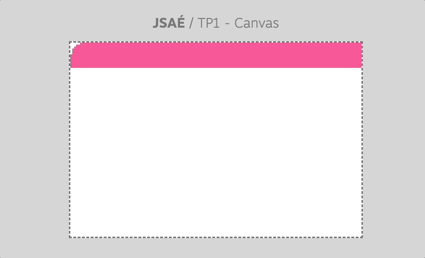

	Bon, par contre comme vous le constatez, le dessin précédent n'est pas effacé, laissant une espèce de "trace" derrière le monstre 😭

5. pour effacer cette "trace" disgracieuse, utilisez la méthode [`context.clearRect` _(mdn)_](https://developer.mozilla.org/fr/docs/Web/API/CanvasRenderingContext2D/clearRect)

	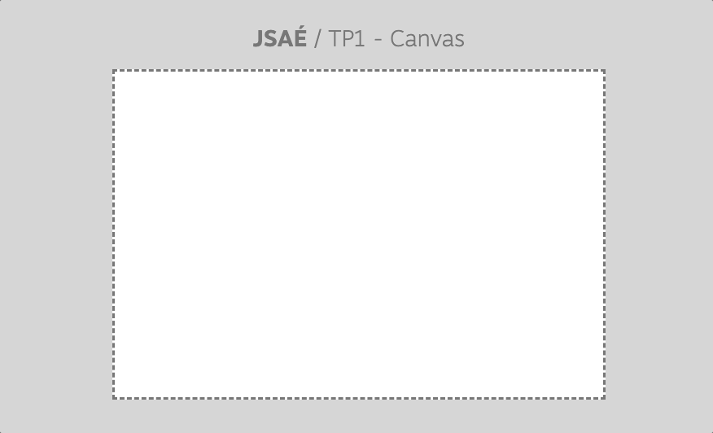

6. Passons maintenant à un déplacement un peu plus complexe :
	- le monstre se déplace aussi en `y`
	- quand il rencontre une bordure du canvas, il "rebondit" dessus pour repartir dans l'autre sens

	> _**Indice :** puisque maintenant le monstre peut se déplacer dans tous les sens, notre `x++` ne fonctionnera pas, on va avoir besoin de deux variables vx/vx ou xDirection/yDirection pour savoir si l'on fait `x++` ou `x--`..._

	> _**Indice 2 :** nos calculs "métiers" ne doivent pas se faire dans le `requestAnimationFrame()` mais bien dans notre boucle qui gère le "modèle" avec `setInterval()` !_

	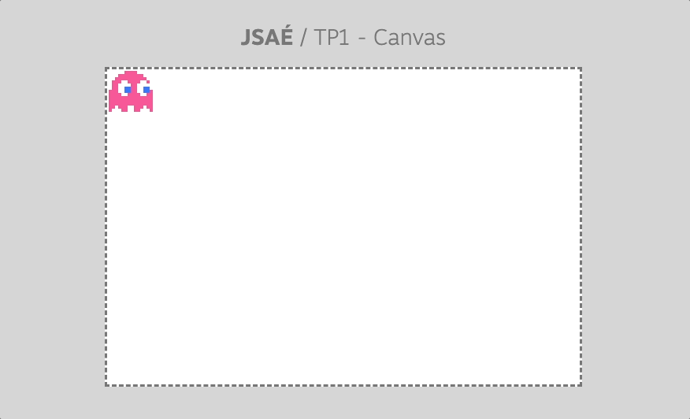


## F. Contrôle avec le clavier

Maintenant que votre monstre peut se déplacer tout seul dans toutes les directions, apprenons lui un peu la discipline et contrôlons le à l'aide des touches du <kbd>C</kbd><kbd>L</kbd><kbd>A</kbd><kbd>V</kbd><kbd>I</kbd><kbd>E</kbd><kbd>R</kbd>.

1. Initialisez vos variables de vitesse / direction à 0 : le monstre doit rester fixe à l'écran

2. Quand l'utilisateur.rice appuie sur la touche <kbd>➭</kbd> (flèche vers la droite), modifiez la vitesse / direction pour que le monstre se déplace vers la droite. \
	Quand on relâche la touche du clavier, le mouvement s'arrête.

	> _**Indice :** Vous aurez probablement besoin des événements [`keydown` (mdn)](https://developer.mozilla.org/fr/docs/Web/API/Element/keydown_event), [`keyup` (mdn)](https://developer.mozilla.org/fr/docs/Web/API/Element/keyup_event) et de la propriété [`event.key` (mdn)](https://developer.mozilla.org/fr/docs/Web/API/KeyboardEvent/key) !_

3. Une fois que le déplacement de gauche à droite fonctionne, faites de même pour les 3 autres directions (droite/haut/bas) !

## G. A propos de la taille du canvas

La balise canvas permet de faire du dessin bitmap (_à la différence des balises svg qui permettent de faire du dessin vectoriel_).

Le navigateur a donc besoin de connaître à l'avance la résolution (_le nombre de pixels en largeur et en hauteur à rendre_). C'est la raison pour laquelle il faut toujours spécifier dans le code HTML les attributs `width` et `height` et qu'il n'est pas simple de redimensionner le canvas en CSS.

Pour en avoir le coeur net, essayons de redimensionner le canvas en CSS pour voir ce que ça donne :

1. dans la balise `<style>` du fichier `index.html`, mettez une largeur de 100% et une hauteur de 200px sur le canvas :
   ```css
   canvas {
		/* modification de la taille du canvas */
		width: 100%;
		height: 200px;
	}
   ```

   On voit que l'image est complètement écrasée. \
   Pour modifier les dimensions du canvas, il faut donc TOUJOURS modifier les attributs HTML de la balise pour que le navigateur recalcule correctement tous les pixels du canvas.

	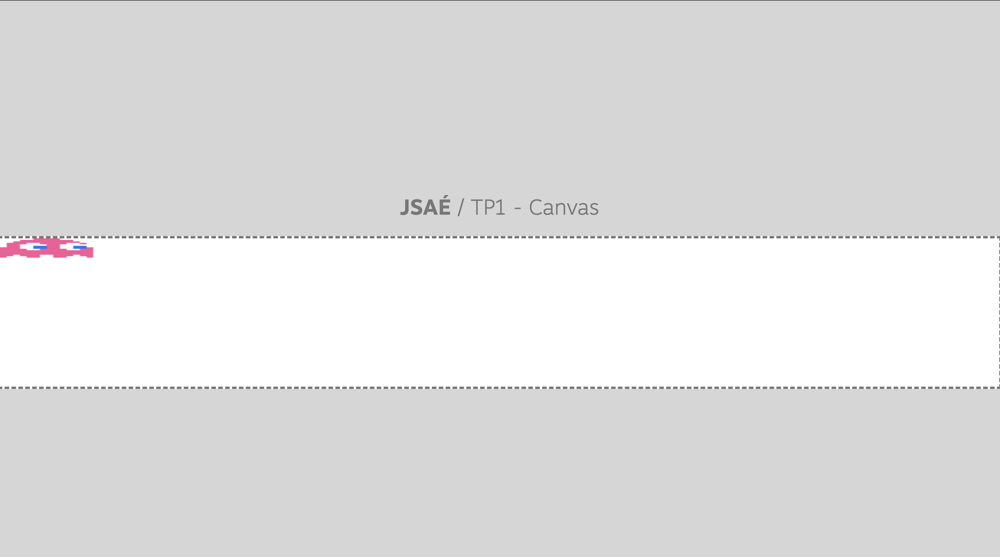

2. La technique la plus "propre" consiste à donner une taille CSS en pourcentage, écouter le redimensionnement du canvas par la CSS pour recalculer les attributs width et height corrects.

	Le code n'est pas évident à trouver seul, le voici donc :
	```js
	const canvasResizeObserver = new ResizeObserver(() => resampleCanvas());
	canvasResizeObserver.observe(canvas);

	function resampleCanvas() {
		canvas.width = canvas.clientWidth;
		canvas.height = canvas.clientHeight;
	}
	```

	

	Pour mettre votre canvas en "plein écran", vous pouvez maintenant ajouter le code suivant aux styles du canvas :

	```css
	width: 100%;
	height: 100%;
	position: absolute;
	top: 0;
	left: 0;
	border: none;
	```


## H. Mise en pratique : un monstre dans un tableau blanc
Maintenant que vous savez (presque) tout sur le canvas, vous devez être capable de fusionner le mini-jeu développé à l'étape précédente avec l'application de tableau blanc qui permette de faire avancer le petit monstre par dessus un tableau blanc dans lequel on peut dessiner.

**Cet exercice est un peu plus compliqué qu'il n'y paraît puisque dans l'exercice du monstre, on utilise `context.clearRect()` ce qui a pour effet de vider le canvas à chaque render...** il va falloir trouver un moyen de recréer l'intégralité du dessin à chaque fois qu'on redessine le monstre...

Si vous y parvenez, alors vous pouvez améliorer l'application de dessin avec des fonctionnalités plus poussées, avec des boutons qui permettent de :
- choisir l'épaisseur du trait
- choisir la couleur du trait
- appliquer ou non une couleur de remplissage à la forme dessinée
- dessiner des primitives simples (carré/rectangle/cercle) (ça peut être l'occasion de tester les méthodes [`context.translate` _(mdn)_](https://developer.mozilla.org/fr/docs/Web/API/CanvasRenderingContext2D/translate)/[`context.scale` _(mdn)_](https://developer.mozilla.org/fr/docs/Web/API/CanvasRenderingContext2D/scale))
- dessiner des formes plus complexes comme un triangle, une étoile, etc.
- faire défiler le dessin au fur et à mesure...

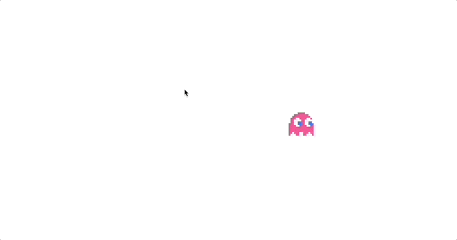


