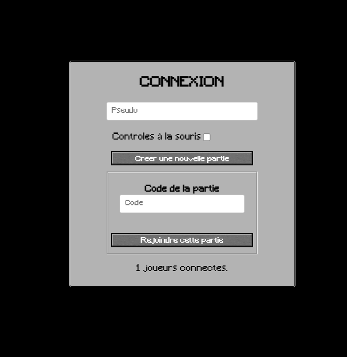
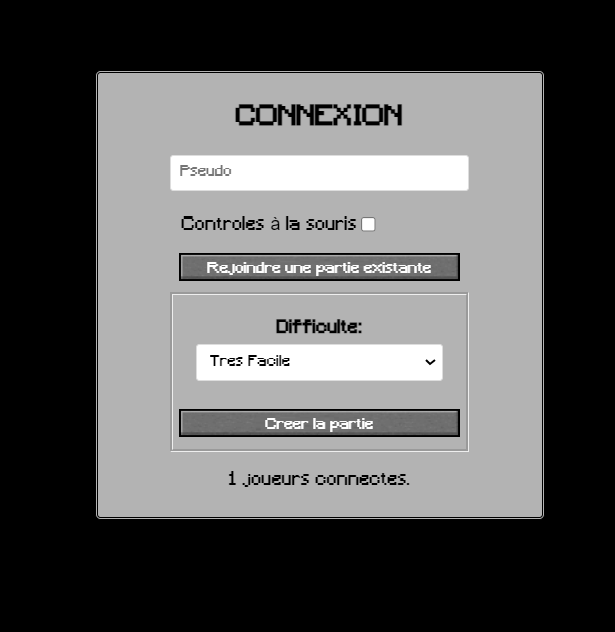
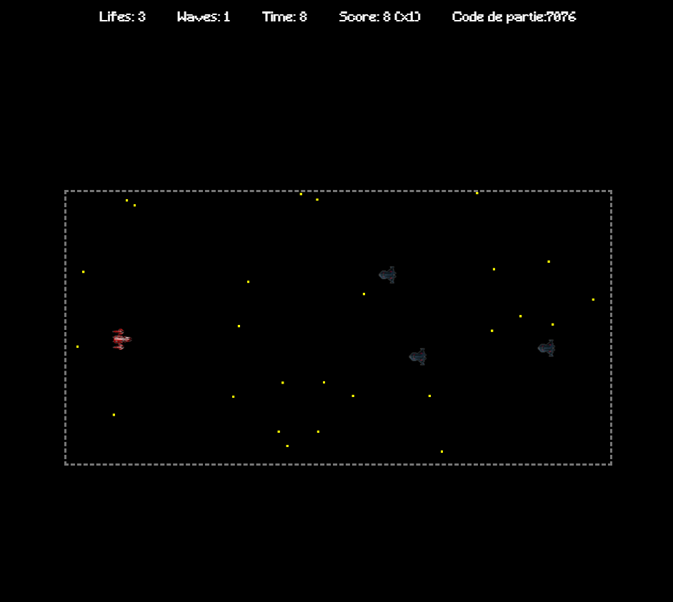
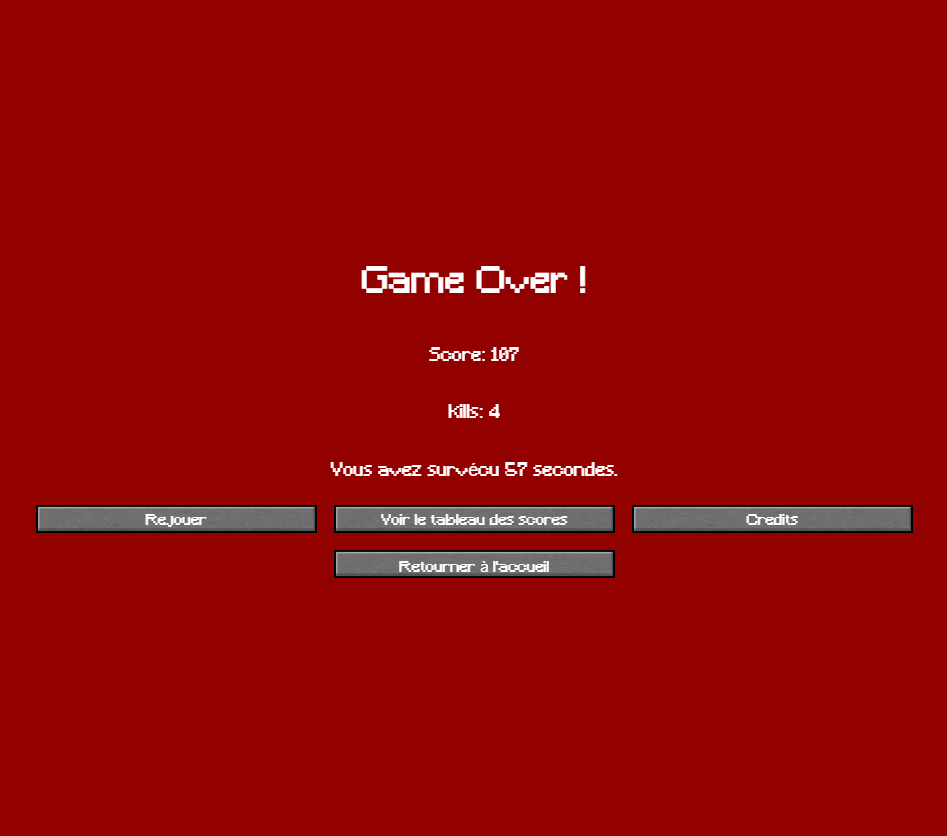
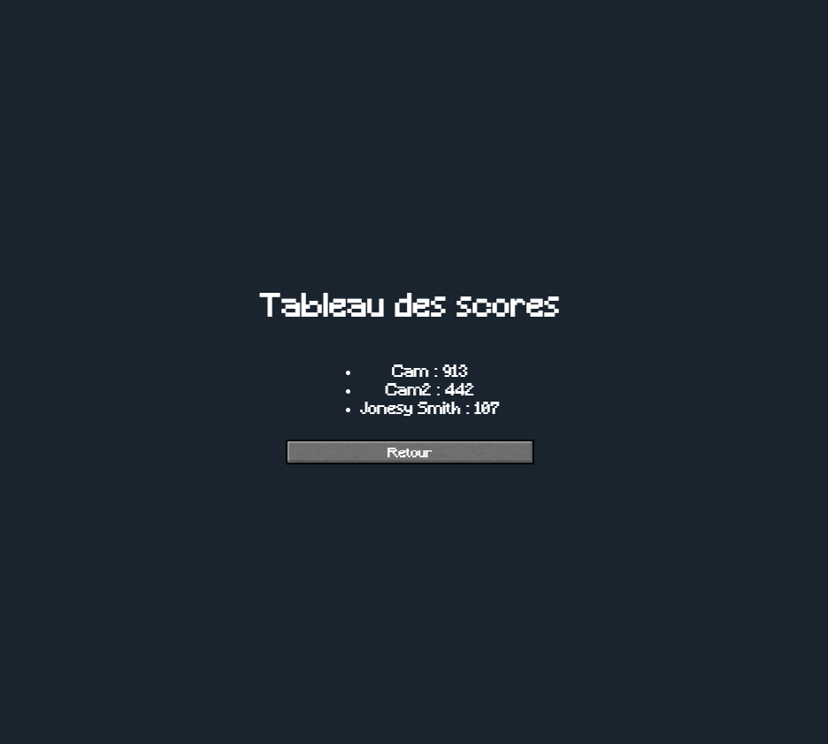
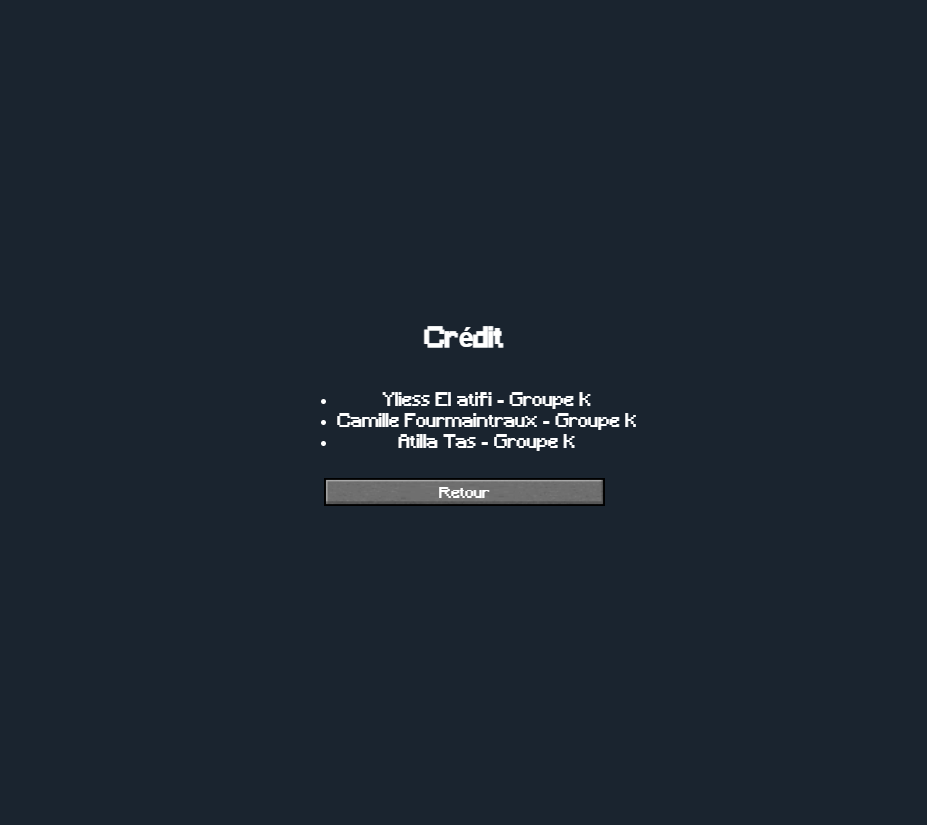
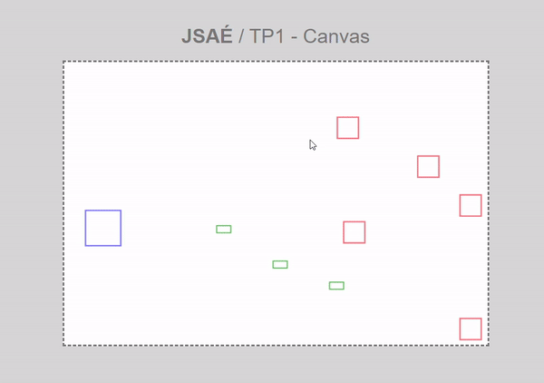
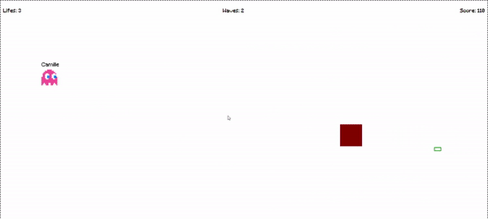
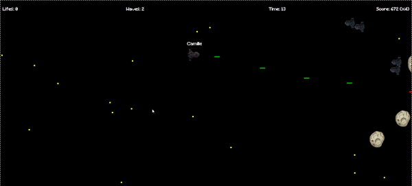

# SAÉ 4.A.01.2 - Développement d'une application complexe

Objectif : Réaliser un jeu en ligne multi-joueur de type "shoot them up" par équipe de 3.

## Participants

- [Yliess El atifi](yliess.elatifi.etu@univ-lille.fr)
- [Fourmaintraux Camille](camille.fourmaintraux.etu@univ-lille.fr)
- [Atilla Tas](atilla.tas.etu@univ-lille.fr)

## Les Vues

L'accueil - Rejoindre une partie

L'accueil - Créer une partie

Lorsque l'on est en jeu

L'écran de Game Over

Le tableau des scores

Les crédits

## Diagrammes des échanges client/serveur

### Explications
texte

## Milestones

### Version basique (prototype)

#### Description
L'objectif de ce prototype était de comprendre tout ce qui était nécessaire pour faire la base du jeu. C'est à dire comment :
- dessiner avec le canvas
- faire une boucle de jeu
- récupérer les inputs du joueur
- comment déclencher un tir
- faire des déplacements fluides
- détecter des collisions

#### Difficultés techniques
Ici la plus grande difficulté à été de faire le système de collision. Au final nous avons créer une classe Entity qui gère les collisions et que tous les autres classes étendent, de cette manière n'importe quel chose dans notre jeu peut détecter n'importe quel autre, selon ce qu'on veut.

### Version intermédiaire

#### Description
Dans la 2ème Milestone, nous avons voulu tester d'ajouter plus de fonctionnalités, encore une fois sans nous soucier de l'apparence du jeu, uniquement la jouabilité. Dans cette version, nous avons ajouté :
- les premiers élements de ATH (les vies, les vagues, le score)
- différents types d'ennemis
- la possibilité aux ennemis de tirer et de blesser le joueur
- Premiers ajouts d'images
- Ajouts d'un formulaire de 'connexion' demandant le pseudo pour l'afficher au dessus du joueur en jeu.

#### Difficultés techniques
La plus grande difficulté que nous avons rencontré dans cette version à été de chargé les images afin qu'elles s'affichent correctement dans le jeu. Il a fallu créer un ImageLoader, qui doit chargé les images dans le jeu dès le début, afin qu'elles soient disponible dès qu'on en a besoin après une fois dans le jeu.

### Version avancée

#### Description
Cette version améliore l'écran de connexion ainsi que les déplacements en ajoutant l'accélération et l'inertie.
De plus, cette version ajoute aussi :
- Un écran de GameOver quand le joueur n'a plus de vie
- Un fond d'écran qui défile
- Les premiers effets sonores
- Plus d'images, amélioration des effets visuels
- Introduction au multijoueur

#### Difficultés techniques
C'est à cette version que nous avons introduis le multijoueur.
La transition du jeu complet solo en un jeu complet multijoueur était trop compliqué, nous avons donc dû repartir de zéro, et tout recoder jusqu'ici en incluant cette fois-ci le multijoueur afin que le projet puisse fonctionner.

### Version achevé

#### Description
Dans cette version finale du jeu, nous avons ajouté les salles(room) afin que plusieurs parties puissent être jouées en même temps indépendamment les unes des autres.

#### Difficultés techniques
Améliorer les performances et ajouter les rooms ont étés les plus gros défis de cette dernière versions.

## Points d'améliorations possible
Pour ce projet, ce qui serais le plus important à améliorer ce sont les performances. Le serveur à parfois du mal à suivre si il y a trop de client ou trop d'élements à l'écran.
Le deuxième plus important serait d'ajouter plus de fonctionnalités pour rendre le jeu plus riche, comme des niveaux, choix entre différents skin pour le joueur, plus de Boss, etc... 

## Ce dont on est le plus fier

//A Faire 

perso : les mouvements fluides. Les déplacements du joueur, ses tirs, l'inertie, l'accélération, tout ça s'emboitent bien et rendent le jeu agréable à jouer. L'effet de particules et l'effet sonore à la mort des ennemis aussi.

